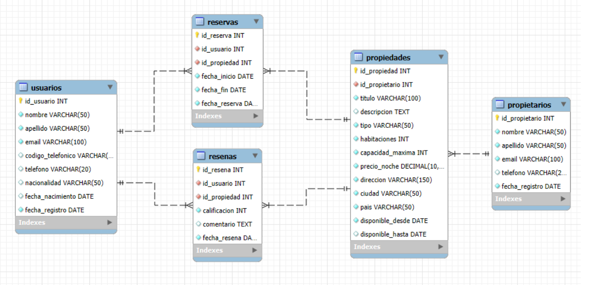

# HeyRoommate-Sceia

## 1. Introducción
HeyRoommate es una aplicación diseñada para facilitar que las personas encuentren compañeros de habitación (roommates) de manera segura y organizada. La plataforma permite que los usuarios se registren, busquen propiedades compartidas y realicen reservas, priorizando la experiencia de convivencia sobre el simple alquiler.

### Objetivo
El objetivo de este proyecto es diseñar, implementar y documentar una base de datos relacional que respalde las operaciones de la aplicación **HeyRoommate**.  
La base de datos está pensada para gestionar de forma eficiente la información relacionada con usuarios, propietarios, propiedades, reservas y reseñas, considerando las particularidades del modelo de negocio centrado en facilitar que personas puedan encontrar y compartir alojamiento como roommates.

Este trabajo incluye:  
- Diseño de las tablas y sus relaciones.  
- Definición de claves primarias, foráneas y restricciones necesarias para garantizar la integridad de los datos.  
- Inserción de datos de ejemplo para pruebas y validaciones.

## 2. Situación Problemática
En muchas ciudades, encontrar un roommate adecuado y una propiedad que permita compartir gastos resulta complejo y consume tiempo. HeyRoommate resuelve este problema ofreciendo una base de datos bien estructurada que permite filtrar opciones según la capacidad máxima de inquilinos y otros criterios relevantes.

## 3. Modelo de Negocio
HeyRoommate funciona como una plataforma intermediaria entre propietarios que publican propiedades disponibles y usuarios que desean alquilar parcial o totalmente dichos espacios. A diferencia de otras aplicaciones, el foco principal es permitir que varias personas compartan una propiedad como roommates, con un límite máximo definido por el propietario.

El flujo básico es:  
1. Un propietario publica una propiedad indicando su capacidad máxima de usuarios.  
2. Un usuario interesado puede reservar la propiedad.  
3. Una vez finalizada la estancia, el usuario puede dejar una reseña.

## 4. Diagrama Entidad-Relación

## 5. Listado de Tablas

### Tabla: `usuarios`

| Campo             | Tipo de dato          | Clave      | Descripción                                   |
|-------------------|----------------------|------------|-----------------------------------------------|
| id_usuario        | INT AUTO_INCREMENT   | PK         | Identificador único del usuario                |
| rol               | ENUM                 |            | Rol del usuario: propietario, inquilino o admin|
| nombre            | VARCHAR(50)          |            | Nombre del usuario                             |
| apellido          | VARCHAR(50)          |            | Apellido del usuario                           |
| email             | VARCHAR(100)         | UNIQUE     | Correo electrónico único                       |
| codigo_telefonico | VARCHAR(5)           |            | Código internacional del teléfono              |
| telefono          | VARCHAR(20)          |            | Número de teléfono                             |
| nacionalidad      | VARCHAR(50)          |            | Nacionalidad del usuario                       |
| fecha_nacimiento  | DATE                 |            | Fecha de nacimiento                            |
| fecha_registro    | DATE                 |            | Fecha en que se registró en la plataforma      |

---

### Tabla: `propiedades`

| Campo             | Tipo de dato          | Clave      | Descripción                                   |
|-------------------|----------------------|------------|-----------------------------------------------|
| id_propiedad      | INT AUTO_INCREMENT   | PK         | Identificador único de la propiedad            |
| id_usuario        | INT                  | FK         | Usuario que publica la propiedad (propietario) |
| titulo            | VARCHAR(100)         |            | Título descriptivo de la propiedad             |
| descripcion       | TEXT                 |            | Descripción detallada de la propiedad          |
| tipo              | VARCHAR(50)          |            | Tipo de propiedad (casa, depto, etc.)          |
| habitaciones      | INT                  |            | Número de habitaciones                         |
| capacidad_maxima  | INT                  |            | Cantidad máxima de usuarios que pueden habitar |
| precio_noche      | DECIMAL(10,2)        |            | Precio por noche                               |
| direccion         | VARCHAR(150)         |            | Dirección completa                             |
| ciudad            | VARCHAR(50)          |            | Ciudad donde se ubica                          |
| pais              | VARCHAR(50)          |            | País donde se ubica                            |
| disponible_desde  | DATE                 |            | Fecha desde la cual está disponible            |
| disponible_hasta  | DATE                 |            | Fecha hasta la cual está disponible (opcional) |

---

### Tabla: `reservas`

| Campo             | Tipo de dato          | Clave      | Descripción                                   |
|-------------------|----------------------|------------|-----------------------------------------------|
| id_reserva        | INT AUTO_INCREMENT   | PK         | Identificador único de la reserva              |
| id_usuario        | INT                  | FK         | Usuario que realiza la reserva                 |
| id_propiedad      | INT                  | FK         | Propiedad reservada                            |
| fecha_inicio      | DATE                 |            | Fecha de inicio de la reserva                  |
| fecha_fin         | DATE                 |            | Fecha de fin de la reserva                     |
| estado            | ENUM                 |            | Estado: pendiente, aceptada, rechazada, cancelada, finalizada |
| fecha_creacion    | TIMESTAMP            |            | Fecha en que se creó la reserva                |

---

### Tabla: `resenas`

| Campo             | Tipo de dato          | Clave      | Descripción                                   |
|-------------------|----------------------|------------|-----------------------------------------------|
| id_resena         | INT AUTO_INCREMENT   | PK         | Identificador único de la reseña               |
| id_usuario        | INT                  | FK         | Usuario que dejó la reseña                     |
| id_propiedad      | INT                  | FK         | Propiedad evaluada                             |
| calificacion      | INT                  |            | Puntuación entre 1 y 5                         |
| comentario        | VARCHAR(500)         |            | Comentario de hasta 500 caracteres             |
| fecha_resena      | TIMESTAMP            |            | Fecha y hora en que se dejó la reseña          |

---

### Tabla: `auditoria`

| Campo                | Tipo de dato          | Clave      | Descripción                                   |
|----------------------|----------------------|------------|-----------------------------------------------|
| id_auditoria         | INT AUTO_INCREMENT   | PK         | Identificador único de la auditoría            |
| tabla                | VARCHAR(50)          |            | Nombre de la tabla afectada                    |
| accion               | ENUM                 |            | Acción realizada: INSERT, UPDATE o DELETE      |
| id_registro          | INT                  |            | Identificador del registro afectado             |
| id_usuario_responsable | INT                |            | Usuario responsable de la acción                |
| fecha_evento         | TIMESTAMP            |            | Fecha y hora del evento                         |
| detalle              | TEXT                 |            | Información adicional o detalle del cambio      |

[Script SQL Tablas](tablas.sql)

[Script SQL Inserts de Prueba](ejemplo_inserts.sql)
