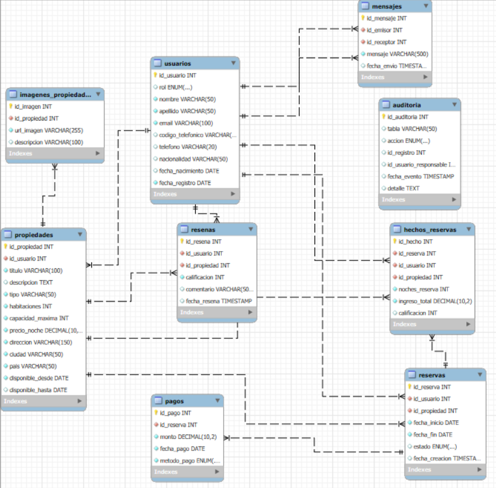
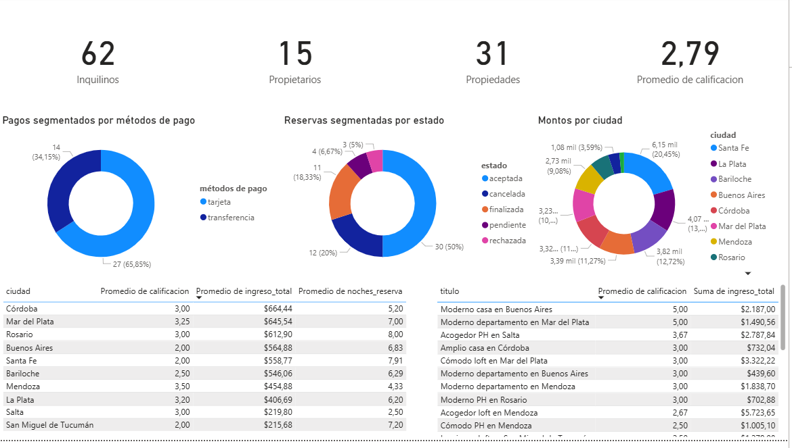

# HeyRoommate-Sceia

## 📑 Índice
1. [Introducción](#1-introducción)  
2. [Situación Problemática](#2-situación-problemática)  
3. [Modelo de Negocio](#3-modelo-de-negocio)  
4. [Diagrama Entidad-Relación](#4-diagrama-entidad-relación)  
5. [Listado de Tablas](#5-listado-de-tablas)  
6. [Listado de Vistas](#6-listado-de-vistas)  
7. [Listado Funciones](#7-listado-funciones)  
8. [Listado Stored Procedures](#8-listado-stored-procedures)  
9. [Listado de Triggers](#9-listado-de-triggers)  
10. [Análisis de datos](#10-analisis-de-datos)  

## 1. Introducción
HeyRoommate es una aplicación diseñada para facilitar que las personas encuentren compañeros de habitación (roommates) de manera segura y organizada. La plataforma permite que los usuarios se registren, busquen propiedades compartidas y realicen reservas, priorizando la experiencia de convivencia sobre el simple alquiler.

### Objetivo
El objetivo de este proyecto es diseñar, implementar y documentar una base de datos relacional que respalde las operaciones de la aplicación **HeyRoommate**.  
La base de datos está pensada para gestionar de forma eficiente la información relacionada con usuarios, propietarios, propiedades, reservas y reseñas, considerando las particularidades del modelo de negocio centrado en facilitar que personas puedan encontrar y compartir alojamiento como roommates.

Este trabajo incluye:  
- Diseño de las tablas y sus relaciones.  
- Definición de claves primarias, foráneas y restricciones necesarias para garantizar la integridad de los datos.  
- Inserción de datos de ejemplo para pruebas y validaciones.

## 2. Situación Problemática
En muchas ciudades, encontrar un roommate adecuado y una propiedad que permita compartir gastos resulta complejo y consume tiempo. HeyRoommate resuelve este problema ofreciendo una base de datos bien estructurada que permite filtrar opciones según la capacidad máxima de inquilinos y otros criterios relevantes.

## 3. Modelo de Negocio
HeyRoommate funciona como una plataforma intermediaria entre propietarios que publican propiedades disponibles y usuarios que desean alquilar parcial o totalmente dichos espacios. A diferencia de otras aplicaciones, el foco principal es permitir que varias personas compartan una propiedad como roommates, con un límite máximo definido por el propietario.

El flujo básico es:  
1. Un propietario publica una propiedad indicando su capacidad máxima de usuarios.  
2. Un usuario interesado puede reservar la propiedad.  
3. Una vez finalizada la estancia, el usuario puede dejar una reseña.

## 4. Diagrama Entidad-Relación

## 5. Listado de Tablas

### Tabla: `usuarios`

| Campo             | Tipo de dato          | Clave      | Descripción                                   |
|-------------------|----------------------|------------|-----------------------------------------------|
| id_usuario        | INT AUTO_INCREMENT   | PK         | Identificador único del usuario                |
| rol               | ENUM                 |            | Rol del usuario: propietario, inquilino o admin|
| nombre            | VARCHAR(50)          |            | Nombre del usuario                             |
| apellido          | VARCHAR(50)          |            | Apellido del usuario                           |
| email             | VARCHAR(100)         | UNIQUE     | Correo electrónico único                       |
| codigo_telefonico | VARCHAR(5)           |            | Código internacional del teléfono              |
| telefono          | VARCHAR(20)          |            | Número de teléfono                             |
| nacionalidad      | VARCHAR(50)          |            | Nacionalidad del usuario                       |
| fecha_nacimiento  | DATE                 |            | Fecha de nacimiento                            |
| fecha_registro    | DATE                 |            | Fecha en que se registró en la plataforma      |

---

### Tabla: `propiedades`

| Campo             | Tipo de dato          | Clave      | Descripción                                   |
|-------------------|----------------------|------------|-----------------------------------------------|
| id_propiedad      | INT AUTO_INCREMENT   | PK         | Identificador único de la propiedad            |
| id_usuario        | INT                  | FK         | Usuario que publica la propiedad (propietario) |
| titulo            | VARCHAR(100)         |            | Título descriptivo de la propiedad             |
| descripcion       | TEXT                 |            | Descripción detallada de la propiedad          |
| tipo              | VARCHAR(50)          |            | Tipo de propiedad (casa, depto, etc.)          |
| habitaciones      | INT                  |            | Número de habitaciones                         |
| capacidad_maxima  | INT                  |            | Cantidad máxima de usuarios que pueden habitar |
| precio_noche      | DECIMAL(10,2)        |            | Precio por noche                               |
| direccion         | VARCHAR(150)         |            | Dirección completa                             |
| ciudad            | VARCHAR(50)          |            | Ciudad donde se ubica                          |
| pais              | VARCHAR(50)          |            | País donde se ubica                            |
| disponible_desde  | DATE                 |            | Fecha desde la cual está disponible            |
| disponible_hasta  | DATE                 |            | Fecha hasta la cual está disponible (opcional) |

---

### Tabla: `reservas`

| Campo             | Tipo de dato          | Clave      | Descripción                                   |
|-------------------|----------------------|------------|-----------------------------------------------|
| id_reserva        | INT AUTO_INCREMENT   | PK         | Identificador único de la reserva              |
| id_usuario        | INT                  | FK         | Usuario que realiza la reserva                 |
| id_propiedad      | INT                  | FK         | Propiedad reservada                            |
| fecha_inicio      | DATE                 |            | Fecha de inicio de la reserva                  |
| fecha_fin         | DATE                 |            | Fecha de fin de la reserva                     |
| estado            | ENUM                 |            | Estado: pendiente, aceptada, rechazada, cancelada, finalizada |
| fecha_creacion    | TIMESTAMP            |            | Fecha en que se creó la reserva                |

---

### Tabla: `resenas`

| Campo             | Tipo de dato          | Clave      | Descripción                                   |
|-------------------|----------------------|------------|-----------------------------------------------|
| id_resena         | INT AUTO_INCREMENT   | PK         | Identificador único de la reseña               |
| id_usuario        | INT                  | FK         | Usuario que dejó la reseña                     |
| id_propiedad      | INT                  | FK         | Propiedad evaluada                             |
| calificacion      | INT                  |            | Puntuación entre 1 y 5                         |
| comentario        | VARCHAR(500)         |            | Comentario de hasta 500 caracteres             |
| fecha_resena      | TIMESTAMP            |            | Fecha y hora en que se dejó la reseña          |

---

### Tabla: `pagos`

| Campo             | Tipo de dato          | Clave      | Descripción                                   |
|-------------------|----------------------|------------|-----------------------------------------------|
| id_pago           | INT AUTO_INCREMENT   | PK         | Identificador único del pago                   |
| id_reserva        | INT                  | FK         | Identificador único de la reseña               |
| monto             | DECIMAL(10,2)        |            | Monto pagado                                   |
| fecha_pago        | DATE                 |            | Fecha cuando se realizo el pago                |
| metodo_pago       | ENUM                 |            | Metodo utilizado: tarjeta o transferencia      |

---

### Tabla: `mensajes`

| Campo             | Tipo de dato          | Clave      | Descripción                                   |
|-------------------|----------------------|------------|-----------------------------------------------|
| id_mensaje        | INT AUTO_INCREMENT   | PK         | Identificador único del pago                   |
| id_emisor         | INT                  | FK         | Usuario que envio el mensaje                   |
| id_receptor       | INT                  | FK         | Usuario que recibe el mensaje                  |
| mensaje           | VARCHAR(500)         |            | Texto enviado                                  |
| fecha_envio       | DATE                 |            | Fecha cuando se envio el mensaje               |

---

### Tabla: `imagenes_propiedades`

| Campo             | Tipo de dato          | Clave      | Descripción                                   |
|-------------------|----------------------|------------|-----------------------------------------------|
| id_imagen         | INT AUTO_INCREMENT   | PK         | Identificador único de la imagen               |
| id_propiedad      | INT                  | FK         | Identificador único de la propiedad            |
| url_imagen        | VARCHAR(255)         |            | Dirección web de la imagen                     |
| descripcion       | VARCHAR(100)         |            | Descripción detallada de la imagen             |

---

### Tabla: `hechos_reservas`

| Campo             | Tipo de dato          | Clave      | Descripción                                   |
|-------------------|----------------------|------------|-----------------------------------------------|
| id_hecho          | INT AUTO_INCREMENT   | PK         | Identificador único del hecho                  |
| id_reserva        | INT                  | FK         | Identificador de la reserva                    |
| id_usuario        | INT                  | FK         | Usuario que realiza la reserva                 |
| id_propiedad      | INT                  | FK         | Propiedad reservada                            |
| noches_reserva    | INT                  |            | Cantidad de noches reservadas                  |
| ingreso_total     | DATE                 |            | Ingreso total generado                         |
| calificacion      | ENUM                 |            | Puntuación entre 1 y 5                         |

---

### Tabla: `auditoria`

| Campo                | Tipo de dato          | Clave      | Descripción                                   |
|----------------------|----------------------|------------|-----------------------------------------------|
| id_auditoria         | INT AUTO_INCREMENT   | PK         | Identificador único de la auditoría            |
| tabla                | VARCHAR(50)          |            | Nombre de la tabla afectada                    |
| accion               | ENUM                 |            | Acción realizada: INSERT, UPDATE o DELETE      |
| id_registro          | INT                  |            | Identificador del registro afectado             |
| id_usuario_responsable | INT                |            | Usuario responsable de la acción                |
| fecha_evento         | TIMESTAMP            |            | Fecha y hora del evento                         |
| detalle              | TEXT                 |            | Información adicional o detalle del cambio      |

---

## 6. Listado de Vistas

### `vista_reservas_activas`
- **Objetivo:** Consultar las reservas activas en curso.  
- **Descripción:** Muestra las reservas aceptadas cuya fecha actual se encuentre entre la fecha de inicio y la de fin.  
- **Tablas:** `reservas`, `usuarios`, `propiedades`.

### `vista_reservas_pendientes`
- **Objetivo:** Listar las reservas en estado pendiente.  
- **Descripción:** Presenta datos del inquilino, la propiedad y las fechas de cada reserva pendiente.  
- **Tablas:** `reservas`, `usuarios`, `propiedades`.

### `vista_propiedades_calificacion`
- **Objetivo:** Evaluar propiedades en base a reseñas.  
- **Descripción:** Muestra el promedio de calificación y la cantidad de reseñas por propiedad.  
  Los resultados se ordenan de **mayor a menor calificación promedio**.  
- **Tablas:** `propiedades`, `resenas`.

### `vista_ingresos_propiedades`
- **Objetivo:** Analizar ingresos estimados por propiedad.  
- **Descripción:** Calcula los ingresos generados a partir de reservas aceptadas, multiplicando noches por precio.  
  Los resultados se ordenan de **mayor a menor ingreso estimado**.  
- **Tablas:** `propiedades`, `reservas`.

### `vista_inquilinos_reservas`
- **Objetivo:** Identificar los inquilinos con más reservas.  
- **Descripción:** Cuenta la cantidad total de reservas por usuario con rol de inquilino.  
  Los resultados se ordenan de **mayor a menor cantidad de reservas**.  
- **Tablas:** `usuarios`, `reservas`.

### `vista_propiedades_vencidas`
- **Objetivo:** Detectar propiedades cuya disponibilidad ya venció.  
- **Descripción:** Muestra propiedades con fecha de disponibilidad final anterior a la actual.  
- **Tablas:** `propiedades`.

### `vista_usuarios_inactivos`
- **Objetivo:** Encontrar usuarios sin actividad en la plataforma.  
- **Descripción:** Lista usuarios que no tienen reservas ni propiedades asociadas.  
- **Tablas:** `usuarios`, `reservas`, `propiedades`.

### `vista_auditoria_reciente`
- **Objetivo:** Monitorear cambios recientes.  
- **Descripción:** Lista las operaciones registradas en auditoría durante los últimos 7 días.  
- **Tablas:** `auditoria`.

### `vista_auditoria_usuarios_eliminados`
- **Objetivo:** Seguir el rastro de usuarios eliminados.  
- **Descripción:** Muestra auditorías relacionadas con eliminaciones en la tabla `usuarios`.  
- **Tablas:** `auditoria`.

### `vista_auditoria_reservas_estado`
- **Objetivo:** Analizar modificaciones en reservas.  
- **Descripción:** Lista actualizaciones sobre cambios de estado en reservas.  
- **Tablas:** `auditoria`.

### `vista_auditoria_propiedades`
- **Objetivo:** Controlar inserciones y eliminaciones de propiedades.  
- **Descripción:** Registra acciones de alta y baja de propiedades.  
- **Tablas:** `auditoria`.

### `vista_auditoria_resumen`
- **Objetivo:** Resumir la actividad de auditoría.  
- **Descripción:** Agrupa acciones por tabla y tipo de operación, mostrando el total de registros.  
- **Tablas:** `auditoria`.

### `vista_pagos_propiedades`
- **Objetivo:** Consultar pagos asociados a propiedades.  
- **Descripción:** Muestra los pagos realizados sobre reservas, asociados a cada propiedad.  
- **Tablas:** `pagos`, `reservas`, `propiedades`.

---

## 7. Listado Funciones

### `fn_promedio_calificacion(idProp)`
- **Objetivo:** Obtener la calificación promedio de una propiedad.  
- **Descripción:** Devuelve el promedio de las reseñas de una propiedad específica.  
- **Tablas:** `resenas`.

### `fn_cantidad_resenas_propiedad(idProp)`
- **Objetivo:** Contar las reseñas de una propiedad.  
- **Descripción:** Devuelve el número total de reseñas asociadas a una propiedad.  
- **Tablas:** `resenas`.

### `fn_total_noches_propiedad(idProp)`
- **Objetivo:** Calcular la cantidad total de noches reservadas.  
- **Descripción:** Suma la diferencia en noches de todas las reservas aceptadas de una propiedad.  
- **Tablas:** `reservas`.

### `fn_ingresos_propiedad(idProp)`
- **Objetivo:** Calcular ingresos totales de una propiedad.  
- **Descripción:** Multiplica noches reservadas por el precio de la propiedad para reservas aceptadas.  
- **Tablas:** `reservas`, `propiedades`.

### `fn_cantidad_reservas_usuario(idUser)`
- **Objetivo:** Contar reservas realizadas por un usuario.  
- **Descripción:** Devuelve la cantidad total de reservas de un usuario específico.  
- **Tablas:** `reservas`.

### `fn_total_pagado_reserva(idReserva)`
- **Objetivo:** Consultar el total pagado por una reserva.  
- **Descripción:** Suma los pagos registrados de una reserva.  
- **Tablas:** `pagos`.

### `fn_cantidad_mensajes_usuario(idUser)`
- **Objetivo:** Contar mensajes enviados por un usuario.  
- **Descripción:** Devuelve la cantidad de mensajes emitidos por un usuario.  
- **Tablas:** `mensajes`.

---

## 8. Listado Stored Procedures

### `sp_registrar_usuario`
- **Objetivo:** Registrar un nuevo usuario.  
- **Descripción:** Valida que el email no exista previamente y luego inserta un nuevo registro en la tabla de usuarios.  
- **Tablas:** `usuarios`.

### `sp_registrar_propiedad`
- **Objetivo:** Registrar una nueva propiedad.  
- **Descripción:** Valida que el usuario sea un propietario y agrega la propiedad con sus características.  
- **Tablas:** `usuarios`, `propiedades`.

### `sp_registrar_reserva`
- **Objetivo:** Registrar una reserva.  
- **Descripción:** Verifica que el usuario sea inquilino válido y que las fechas sean correctas antes de crear la reserva.  
- **Tablas:** `usuarios`, `reservas`.

### `sp_cambiar_estado_reserva`
- **Objetivo:** Cambiar el estado de una reserva existente.  
- **Descripción:** Actualiza el estado de la reserva (pendiente, aceptada, rechazada, cancelada o finalizada).  
- **Tablas:** `reservas`.

### `sp_insertar_resena`
- **Objetivo:** Insertar una reseña.  
- **Descripción:** Valida que el usuario haya completado una estadía en la propiedad antes de permitir la reseña.  
- **Tablas:** `reservas`, `resenas`.

### `sp_registrar_pago`
- **Objetivo:** Registrar un pago asociado a una reserva.  
- **Descripción:** Calcula automáticamente el monto total a partir de las fechas de la reserva y el precio de la propiedad, evitando errores manuales.  
- **Tablas:** `reservas`, `propiedades`, `pagos`.

### `sp_enviar_mensaje`
- **Objetivo:** Enviar y registrar un mensaje entre dos usuarios.  
- **Descripción:** Valida que tanto el emisor como el receptor existan antes de registrar el mensaje con la fecha/hora actual.  
- **Tablas:** `mensajes`, `usuarios`.

---

## 9. Listado de Triggers

### `trg_no_borrar_usuario_con_propiedades`
- **Objetivo:** Proteger integridad de datos.  
- **Descripción:** Impide borrar un usuario que tenga propiedades activas.  
- **Tabla:** `usuarios`.

### `trg_validar_reserva`
- **Objetivo:** Evitar reservas superpuestas.  
- **Descripción:** Bloquea la inserción de una reserva si se solapa con otra ya aceptada.  
- **Tabla:** `reservas`.

### `trg_finalizar_reserva`
- **Objetivo:** Actualizar automáticamente reservas vencidas.  
- **Descripción:** Cambia el estado de la reserva a "finalizada" si ya pasó la fecha de fin.  
- **Tabla:** `reservas`.

### `trg_validar_pago_reserva`
- **Objetivo:** Evitar pagos duplicados en reservas.  
- **Descripción:** Bloquea la inserción de un nuevo pago si ya existe uno para la misma reserva.  
- **Tabla:** `pagos`.

### `trg_hechos_reservas_insert`
- **Objetivo:** Poblar la tabla de hechos cuando se crea una reserva.  
- **Descripción:** Al insertarse una nueva fila en `reservas`, calcula la cantidad de noches de la reserva y crea un registro.  
- **Tablas:** `reservas`, `hechos_reservas`.

### `trg_hechos_reservas_pago`
- **Objetivo:** Mantener actualizado el ingreso total en la tabla de hechos.  
- **Descripción:** Tras la inserción de un pago , suma el `monto` del pago al registro correspondiente en `hechos_reservas`.  
- **Tablas:** `pagos`, `hechos_reservas`.

### `trg_hechos_reservas_resena`
- **Objetivo:** Reflejar la calificación final en la tabla de hechos.  
- **Descripción:** Cuando se inserta una reseña, actualiza el campo `calificacion` en `hechos_reservas`.   
- **Tablas:** `resenas`, `reservas`, `hechos_reservas`.

### Triggers de auditoría sobre `usuarios`
- **Objetivo:** Registrar cambios en usuarios.  
- **Descripción:** Insertan registros en la auditoría cuando se crean, actualizan o eliminan usuarios.  
- **Tablas:** `usuarios`, `auditoria`.

### Triggers de auditoría sobre `propiedades`
- **Objetivo:** Registrar cambios en propiedades.  
- **Descripción:** Insertan registros en la auditoría al crear, actualizar o eliminar propiedades.  
- **Tablas:** `propiedades`, `auditoria`.

### Triggers de auditoría sobre `reservas`
- **Objetivo:** Registrar cambios en reservas.  
- **Descripción:** Insertan registros en la auditoría al crear, actualizar o eliminar reservas.  
- **Tablas:** `reservas`, `auditoria`.

### Triggers de auditoría sobre `resenas`
- **Objetivo:** Registrar cambios en reseñas.  
- **Descripción:** Insertan registros en la auditoría al crear, actualizar o eliminar reseñas.  
- **Tablas:** `resenas`, `auditoria`.

[Script SQL Creación Base de Datos](full_script.sql)

[Script SQL Inserción de Datos](ejemplo_inserts.sql)

[Script SQL Tester](tester.sql)

## 10. Análisis de Datos

El análisis fue realizado en **Microsoft Power BI** a partir de las tablas del modelo de datos de la base de datos **HeyRoommate**, incluyendo la tabla de hechos `hechos_reservas` y las tablas de dimensiones relacionadas (`usuarios`, `propiedades`, `reservas`, `resenas`, `pagos`, `mensajes`).  

En el informe se reflejan los siguientes puntos principales:  

1. **Distribución de usuarios en la plataforma**  
   - Este indicador permite dimensionar la base de usuarios y entender la relación entre oferta y demanda.  

2. **Propiedades publicadas**  
   - Refleja el inventario actual de la plataforma.  

3. **Nivel de satisfacción de los usuarios**  
   - Este dato se obtiene a partir de las reseñas cargadas por los inquilinos.  

4. **Pagos segmentados por método de pago**  
   - Permite identificar las preferencias de los usuarios al momento de pagar.  

5. **Reservas segmentadas por estado**  
   - Este dato ayuda a conocer el nivel de concreción de las reservas.  

6. **Ingresos por ciudad**  
   - Esta métrica permite identificar que porcentaje representa cada localidad de la facturación total.  

7. **Detalle de ciudades**  
   - Para cada ciudad se analizan:  
     - Promedio de calificación.  
     - Ingreso total acumulado.  
     - Promedio de noches reservadas.  
   - Esto permite comparar el rendimiento de cada localidad y elaborar un ranking de las más exitosas.
  
7. **Detalle de propiedades**  
   - Para cada propiedad se analizan:  
     - Promedio de calificación.  
     - Ingreso total acumulado.   
   - Esto permite comparar el rendimiento de cada propiedad y elaborar un ranking de las más exitosas.
  
[Dashboards](dashboards.pbix)

---

